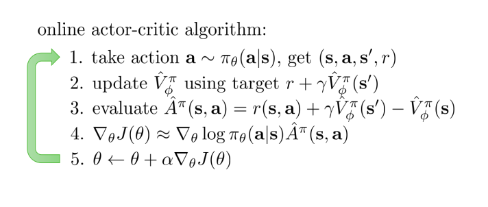
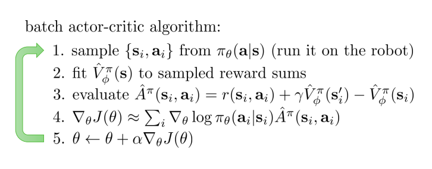
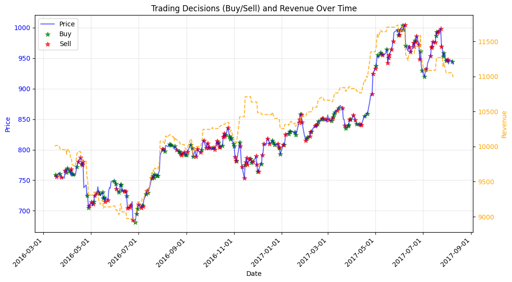
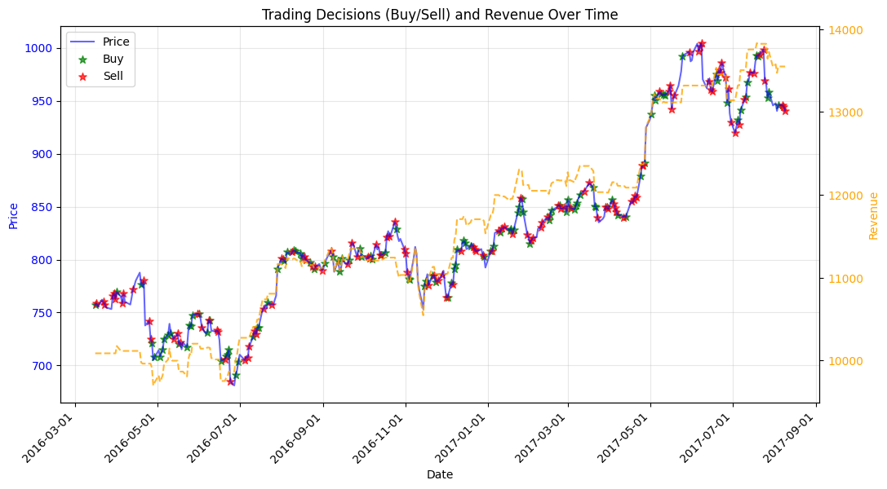
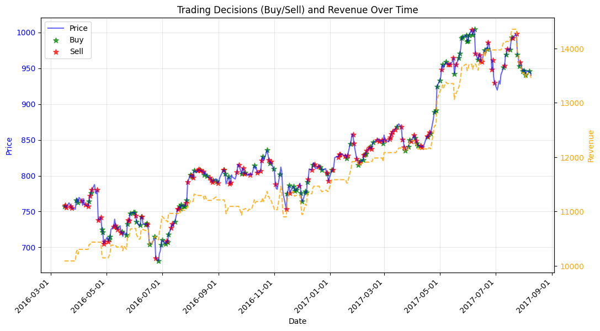
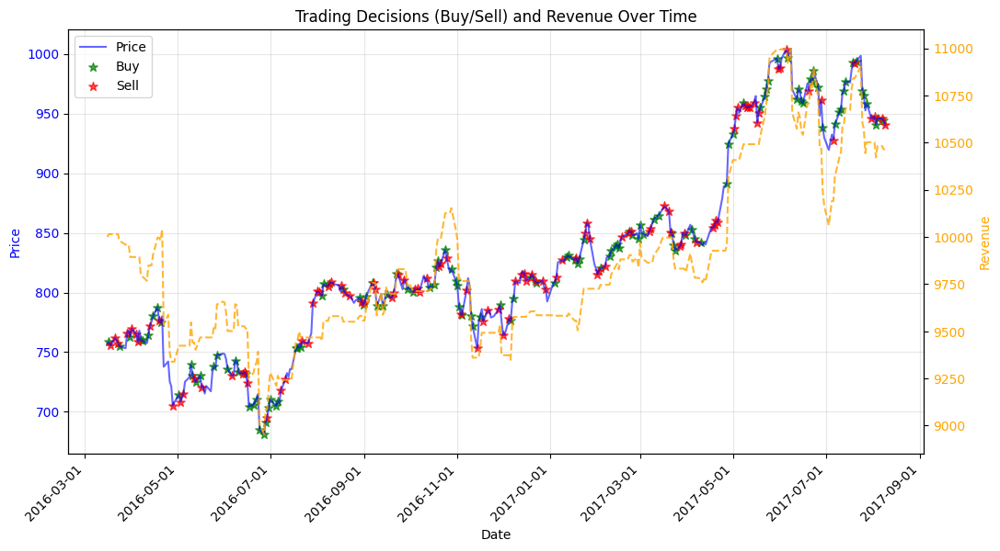
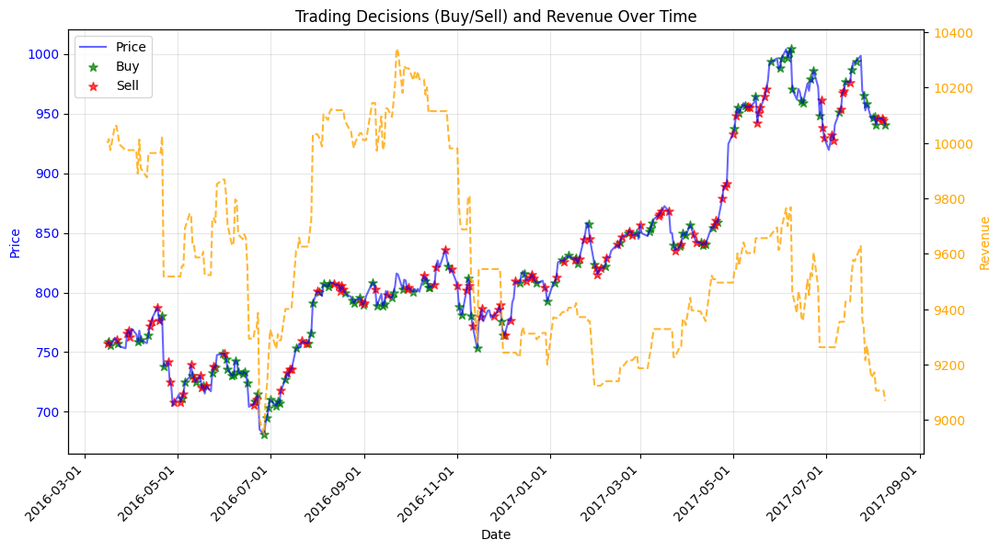

#  Reinforcement Learning Trading Algorithms
A comprehensive implementation of stock price prediction using reinforcement learning techniques: Deep Q-Learning and Actor-Critic algorithms.    
Explore how AI can make trading decisions based on dynamic market data. :purple_heart:  

## Workflow
<ul>
  <li>Installing Python dependencies</li>
  <li>Data preparation:</li>
   <ul>
     <li>Acquiring data from Alpha Vantage stock APIs</li>
     <li>Normalizing raw data</li>
     <li>Generating training and validation datasets</li>
   </ul>
  <li>Defining algorithm models</li>
  <li>Training and evaluation</li>
</ul>

### Installation steps
1. **Create a Virtual Environment**   
    A virtual environment helps isolate project dependencies    
    ```python -m venv venv```
2. **Activate the virtual environment:**       
    ```source venv/bin/activate```
3. **Install requirements:**         
    ```pip install -r requirements.txt```
4. **Deactivate venv:**        
   ```deactivate```

## Interacting with environment


## Trading strategies
1. **Track Actions (Buy/Sell)**
Reward Upon Action: Calculate the reward when the agent takes action (either buying or selling a stock).
When the agent sells a stock after a price increase, it receives a reward proportional to the net worth increase.
When the agent buys after a price decrease, it gets a reward based on the potential recovery.
2. **Inactivity Discount** 
When the agent does nothing (i.e., holds its position or simply observes), apply a discount to the accumulated reward.
If the agent doesn't make a move, reduce the reward by a small percentage (e.g., 0.01%) per step.
This keeps the agent motivated to act, as doing nothing results in an incremental decrease in reward.
3. **Sell and Buy Conditions:**
**Sell:** Reward the agent when it sells stocks that have appreciated in value since the last purchase.
If the agent is holding positions and the price increases by a set threshold (e.g., 2%), reward the agent for taking profits.
**Buy:** Reward the agent when it buys a stock after a price decrease.
If the agent buys a stock that has decreased by a set threshold (e.g., 2%), reward it for potentially catching a rebound or buying at a lower price.
4. **Penalty for Doing Nothing:** 
Every time the agent does nothing (neither buying nor selling), apply the penalty (0.01% of the net worth) to action.
   This penalty ensures the agent doesn't stagnate and keeps making moves to either buy or sell stocks based on the strategy.

**Summary**

    Buy: If the stock price decreases by more than the threshold (e.g., 2%), and the agent does not currently hold the stock, buy.
    Reward = Positive net worth increase when the stock price increases from the purchased price.
    
    Sell: If the stock price increases by more than the threshold (e.g., 2%), and the agent holds the stock, sell.
    Reward = Positive net worth increase when the stock is sold at a higher price.
    
    Inactivity: punish by appling a discount (0.01% of net worth for every step)

## DQL trading results
```
Final Portfolio Value: 11845.86
```


## Double DQL trading results
Results are represented by sell, buy actions. Depending on these decisions the revenue trend line (yellow) is increasing or decreasing. The price trend (blue line) is very volatile. 
### Configuration 
Paste this in your ```config.py``` file.
```
# Training parameters
EPISODES = 1000
BATCH_SIZE = 32
TARGET_UPDATE_FREQ = 5
VALIDATION_INTERVAL = 50

# Data paths
TRAIN_DATA_PATH = './data/AAPL.csv'
TEST_DATA_PATH = './data/GOOG.csv'
TEST_DATA_START = 1400

# Model parameters
GAMMA = 0.95
EPSILON = 1.0
EPSILON_MIN = 0.05
EPSILON_DECAY = 0.995
LEARNING_RATE = 0.001
```
```
Final Portfolio Value: 12894.281143999988
```


## Advantage Actor-Critic (A2C)

A2C starts from the REINFORCE algorithm and tries to reduce policy gradient's variance by substracting a baseline (the state value) from the Q-value. 
The objective function becomes:
$$\Delta_\theta J(\theta) \approx {1 \over N} \sum_{i = 1}^N \sum_{t = 1} ^ T \Delta_\theta log\pi_\theta(a_{i,t} | s_{i,t})A^\pi(s_{i,t},a_{i,t})$$ 
where A is the advantage:
$$ A^\pi(s_{i,t}, a_{i,t}) = Q(s_{i,t}, a_{i,t}) - V(s_{i,t})$$

We could understand the advantage as the function that calculates how advantageous the action $a_{i,t}$ is as compared to the average performance that you expect the policy $\pi_\theta$ to get in the state $s_{i,t}$. So the gradient of the objective function takes the actions that are better than average  and increase probability and take the actions that are worse than average and decrease probability.

Q can be estimate to:
$$Q^\pi(s_t, a_t) \approx r(s_t,a_t) + V^\pi(s_{t+1})$$

So A can be estimate to:
$$A^\pi(s_t,a_t) \approx r(s_t,a_t) + V^\pi(s_{t+1}) - V^\pi(s_t)$$

Now A depends only on the state value function, which is easier to estimate than state-action value function because it takes into account only the state the agent is in. We estimate the state value function by fitting a neural network, "the critic". We represent the policy by an other neural network, "the actor", which takes as input a state and returns a distribution of probabilities for the possible actions.

For fitting the state value function, we have used the MSE loss:
$${\cal L} (\phi) = {1 \over 2} \sum_i ||\hat {V}_\phi^\pi(s_i)-y_i||^2$$

We have implemented two versions of the algorithm, online and with batches, both on-policy algorithms. We have chosen the actor and the critic to be different neural networks, becuase we work with numbers and the two networks don't have common features. 

Initially, we have implemented the online version of the algorithm.



 This algorithm is far from being optimal because of the big variance introduced by the updates of the neural network parameters every time the agent takes an action.

The variance can be reduced if the actions are taken in parallel (synchronous or asynchronous) and the results are recorded in batches before updating the neural network.

The second version of the algorithm collects samples of trajectories and updates the neural networks once for the entire batch.



For both implementations, we have applied discount to decrease variance (with the cost of introducing bias).

### A2C with batches

```
# Training parameters
BATCH_SIZE = 12
TRAJECTORY_LENGTH = 50

# Data paths
TRAIN_DATA_PATH = './data/AAPL.csv'
TEST_DATA_PATH = './data/GOOG.csv'
TEST_DATA_START = 1400

# Model parameters
GAMMA = 0.95
LEARNING_RATE = 0.001
ACTOR_NETWORK_LAYER_NEURONS = 8
CRITIC_NETWORK_LAYER_NEURONS = 8
```
```
EPISODES = 50
Final Portfolio Value: 10989.362058999997
```


```
EPISODES = 140
Final Portfolio Value: 13550.161085000003
```


```
EPISODES = 200
Final Portfolio Value: 13458.452086999994
```


### A2C online

```
# Data paths
TRAIN_DATA_PATH = './data/AAPL.csv'
TEST_DATA_PATH = './data/GOOG.csv'
TEST_DATA_START = 1400

# Model parameters
GAMMA = 0.95
LEARNING_RATE = 0.001
ACTOR_NETWORK_LAYER_NEURONS = 8
CRITIC_NETWORK_LAYER_NEURONS = 8
```
```
EPISODES = 50
Final Portfolio Value: 10464.657096000015
```


```
EPISODES = 140
Final Portfolio Value: 9069.028436999994
```



## DQN vs A2C online vs A2C batch
We selected for the comparison the best results from each algorithm.
- Date training: Acțiuni AAPL.csv
- Date test: Acțiuni GOOG.csv
- Interval de timp: 18 luni (01/03/2016 - 01/09/2017)
- Results: 
  * A2C batch has the biggest return ≅ 12600$ 
  * A2C online has the smallest return ≅ 500$
  * A2C batch has in average comparable results with DQN
  * A2C online is much more unstable than DQN and A2C batch
  * DQN's decisions seem more reasonable than the decisions taken by A2C.


