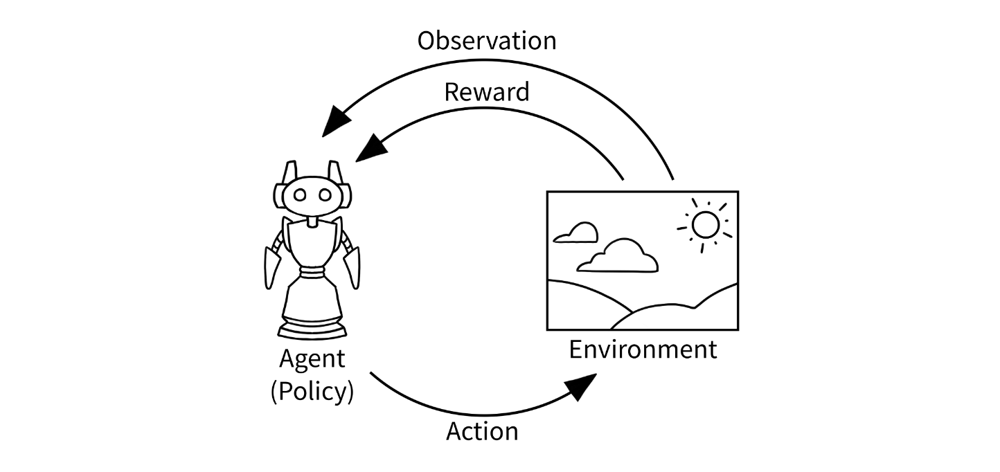
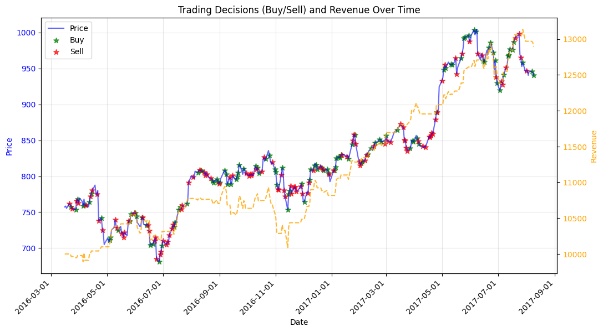
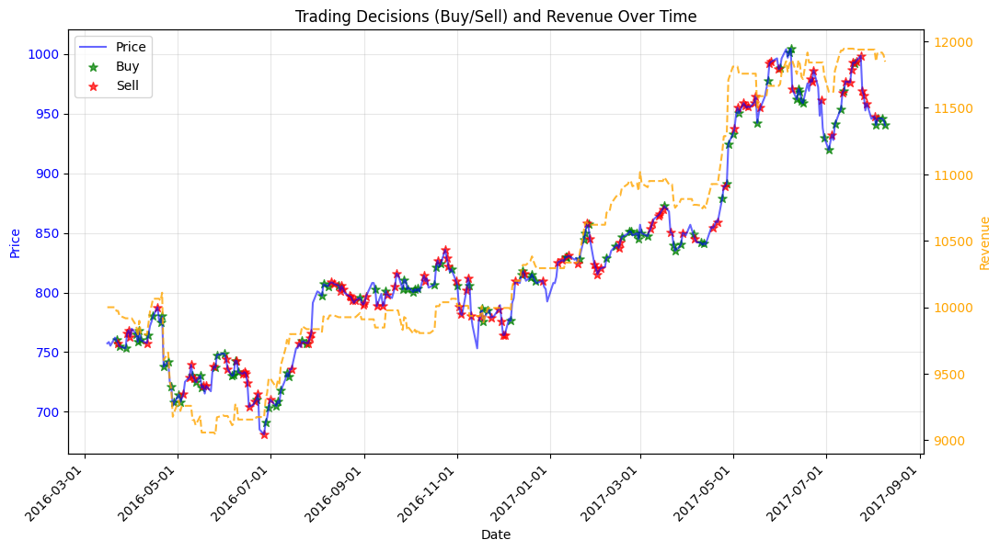

#  Reinforcement Learning Trading Algorithms
A comprehensive implementation of stock price prediction using reinforcement learning techniques: Deep Q-Learning and Actor-Critic algorithms.    
Explore how AI can make trading decisions based on dynamic market data. :purple_heart:  

## Workflow
<ul>
  <li>Installing Python dependencies</li>
  <li>Data preparation:</li>
   <ul>
     <li>Acquiring data from Alpha Vantage stock APIs</li>
     <li>Normalizing raw data</li>
     <li>Generating training and validation datasets</li>
   </ul>
  <li>Defining algorithm models</li>
  <li>Training and evaluation</li>
</ul>

### Installation steps
1. **Create a Virtual Environment**   
    A virtual environment helps isolate project dependencies    
    ```python -m venv venv```
2. **Activate the virtual environment:**       
    ```source venv/bin/activate```
3. **Install requirements:**         
    ```pip install -r requirements.txt```
4. **Deactivate venv:**        
   ```deactivate```

## Interacting with environment


## Trading strategies
1. **Track Actions (Buy/Sell)**
Reward Upon Action: Calculate the reward when the agent takes action (either buying or selling a stock).
When the agent sells a stock after a price increase, it receives a reward proportional to the net worth increase.
When the agent buys after a price decrease, it gets a reward based on the potential recovery.
2. **Inactivity Discount** 
When the agent does nothing (i.e., holds its position or simply observes), apply a discount to the accumulated reward.
If the agent doesn't make a move, reduce the reward by a small percentage (e.g., 0.01%) per step.
This keeps the agent motivated to act, as doing nothing results in an incremental decrease in reward.
3. **Sell and Buy Conditions:**
**Sell:** Reward the agent when it sells stocks that have appreciated in value since the last purchase.
If the agent is holding positions and the price increases by a set threshold (e.g., 2%), reward the agent for taking profits.
**Buy:** Reward the agent when it buys a stock after a price decrease.
If the agent buys a stock that has decreased by a set threshold (e.g., 2%), reward it for potentially catching a rebound or buying at a lower price.
4. **Penalty for Doing Nothing:** 
Every time the agent does nothing (neither buying nor selling), apply the penalty (0.01% of the net worth) to action.
   This penalty ensures the agent doesn't stagnate and keeps making moves to either buy or sell stocks based on the strategy.

**Summary**

    Buy: If the stock price decreases by more than the threshold (e.g., 2%), and the agent does not currently hold the stock, buy.
    Reward = Positive net worth increase when the stock price increases from the purchased price.
    
    Sell: If the stock price increases by more than the threshold (e.g., 2%), and the agent holds the stock, sell.
    Reward = Positive net worth increase when the stock is sold at a higher price.
    
    Inactivity: punish by appling a discount (0.01% of net worth for every step)


## Double DQL trading results
Results are represented by sell, buy actions. Depending on these decisions the revenue trend line (yellow) is increasing or decreasing. The price trend (blue line) is very volatile. 
### Configuration 
Paste this in your ```config.py``` file.
```
# Training parameters
EPISODES = 1000
BATCH_SIZE = 32
TARGET_UPDATE_FREQ = 5
VALIDATION_INTERVAL = 50

# Data paths
TRAIN_DATA_PATH = './data/AAPL.csv'
TEST_DATA_PATH = './data/GOOG.csv'
TEST_DATA_START = 1400

# Model parameters
GAMMA = 0.95
EPSILON = 1.0
EPSILON_MIN = 0.05
EPSILON_DECAY = 0.995
LEARNING_RATE = 0.001
```
```
Final Portfolio Value: 12894.281143999988
```

## Actor-critic algorithm


## DQL trading results
```
Final Portfolio Value: 11845.86
```
